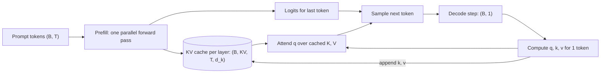
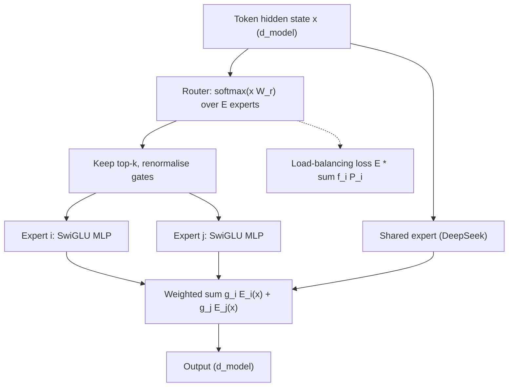
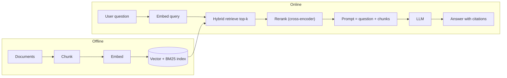
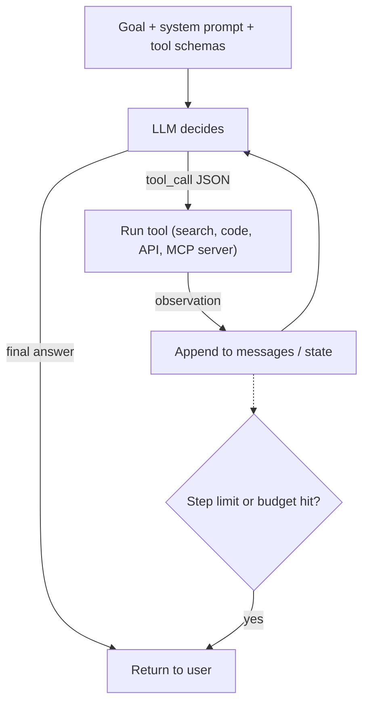

# Attention to Agents · Mermaid diagrams

## Inference: prefill, then decode with a KV cache

```mermaid
flowchart LR
  P["Prompt tokens (B, T)"] --> PF["Prefill: one parallel forward pass"]
  PF --> C[("KV cache per layer: (B, KV, T, d_k)")]
  PF --> L1["Logits for last token"]
  L1 --> S["Sample next token"]
  S --> D["Decode step: (B, 1)"]
  D --> Q["Compute q, k, v for 1 token"]
  Q --> A["Attend q over cached K, V"]
  C --> A
  Q -->|append k, v| C
  A --> S
```

## Sparse Mixture of Experts layer

```mermaid
flowchart TD
  X["Token hidden state x (d_model)"] --> R["Router: softmax(x W_r) over E experts"]
  R --> K["Keep top-k, renormalise gates"]
  K --> E1["Expert i: SwiGLU MLP"]
  K --> E2["Expert j: SwiGLU MLP"]
  X --> SH["Shared expert (DeepSeek)"]
  E1 --> M["Weighted sum g_i E_i(x) + g_j E_j(x)"]
  E2 --> M
  SH --> M
  M --> Y["Output (d_model)"]
  R -.-> LB["Load-balancing loss E * sum f_i P_i"]
```

## Retrieval-augmented generation

```mermaid
flowchart LR
  subgraph Offline
    D["Documents"] --> CH["Chunk"] --> EM["Embed"] --> VS[("Vector + BM25 index")]
  end
  subgraph Online
    U["User question"] --> QE["Embed query"]
    QE --> RT["Hybrid retrieve top-k"]
    VS --> RT
    RT --> RR["Rerank (cross-encoder)"]
    RR --> PR["Prompt = question + chunks"]
    PR --> LLM["LLM"] --> ANS["Answer with citations"]
  end
```

## Agent loop with tools

```mermaid
flowchart TD
  G["Goal + system prompt + tool schemas"] --> LLM["LLM decides"]
  LLM -->|tool_call JSON| T["Run tool (search, code, API, MCP server)"]
  T -->|observation| MEM["Append to messages / state"]
  MEM --> LLM
  LLM -->|final answer| OUT["Return to user"]
  MEM -.-> CAP{"Step limit or budget hit?"}
  CAP -->|yes| OUT
```
